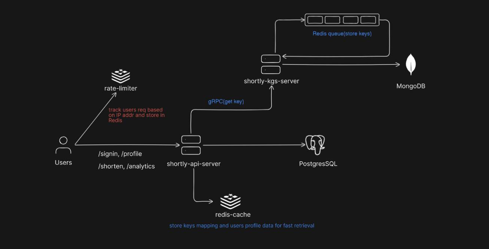

# Shortly - High-Performance URL Shortener with Pre-Generated Key System (KGS)

Shortly is a scalable URL shortener built entirely in Go with a clean microservices architecture. It includes authentication, analytics, rate limiting, Redis-based caching, and a high-performance Key Generation Service (KGS) that pre-generates short keys to ensure consistent latency under heavy load.

## Architecture Overview

Below is a high-level illustration of Shortly’s architecture to help you visualize the flow and interactions between components:

### Service Responsibilities & Components

#### 1. API Service
- Built using **Go** + **Gin** framework for RESTful HTTP APIs.
- Handles user authentication (signup, signin, logout) with JWT tokens.
- Manages URL lifecycle operations: creating shortened URLs, fetching details, updating, deleting, and redirection.
- Communicates internally with the **KGS Service** using gRPC to request pre-generated keys for URL shortening.
- Caches frequently accessed data like user profiles and short key mappings in **Redis** for low-latency reads.
- Implements rate limiting using **Redis** (DB 2) with ulule middleware to protect endpoints from abuse.
- For redirection, looks up the short key in Redis; if cached, instantly issues a **302 redirect** response.
- Store analytics data asynchronously using **Goroutines** to avoid blocking the request lifecycle.

#### 2. Key Generation Service (KGS)
- A dedicated microservice written in **Go** and exposed via **gRPC**.
- Responsible for generating unique short keys ahead of time (pre-generation), avoiding latency spikes during user requests.
- Stores generated keys in **MongoDB** for persistence and in **Redis** (DB 0) as a queue (using `LPUSH`/`RPOP` operations).
- When API service requests a key, KGS pop from Redis queue, marks it as used in MongoDB, and returns it.
- Automatically refills the key queue if the pool size drops below a threshold, ensuring high availability.
- Ensures uniqueness and consistency of keys even under high concurrent load, avoiding collisions. The system can generate up to ~56.8 billion unique keys using 6-character Base62 encoding (62⁶ combinations), with an extremely low probability of collision. 
- Currently updates newly generated keys in MongoDB using bulk operations with `InsertMany`. The current batch size is around **1000 keys**, but with `InsertMany` it can efficiently bulk update up to **100,000 keys** at once.

#### 3. Databases & Caches

- **PostgreSQL:**
  - Stores core relational data: users, URLs, and analytics events.
  - Structured schema supports complex queries and joins for analytics and user management.

- **MongoDB:**
  - Holds the collection of pre-generated short keys.
  - Acts as durable storage for key state (used or available).

- **Redis (Logical DBs):**
  - **DB 0:** Queue of pre-generated keys used by the KGS service.
  - **DB 1:** Cache layer for fast access to user profiles and short key mappings (TTL 24h).
  - **DB 2:** Implements rate limiting counters per user/IP via ulule  middleware.

#### 4. Analytics
- On each redirection or URL access, metadata such as OS, device type, IP address, country, and timestamps are collected.
- Analytics logging is done asynchronously in the API service using Goroutines, ensuring minimal impact on latency.
- Stored in PostgreSQL for reporting and metrics.

## Tech Stack

| Layer         | Technology                        |
|--------------|------------------------------------|
| API Service   | Go + Gin                          |
| Auth          | JWT-based Authentication          |
| Microservice  | Go + gRPC                         |
| Key Queue     | Redis (RPOP/LPUSH as queue)       |
| DB (Main)     | PostgreSQL                        |
| DB (Keys)     | MongoDB                           |
| Cache         | Redis                             |
| Logging       | Slog                              |
| Rate Limiting | Redis + ulule Middleware         |

---

## API Endpoints

All endpoints are prefixed with: `/api/v1`

### Auth
- `POST /auth/signup`
- `POST /auth/signin`
- `POST /auth/logout`

### Profile
- `GET /profile/`
- `PATCH /profile/update`

### URLs
- `GET /url/`
- `POST /url/shorten`
- `GET /url/:shortKey`
- `PATCH /url/:shortKey`
- `DELETE /url/:shortKey`
- `GET /url/redirect/:shortKey` (302 Redirection)

### Analytics
- `GET /analytics/:urlId`

---

# System Workflow (Detailed)

---

## 1. User Signup / Signin

- Users sends a request to:
  - `POST /auth/signup` → Register a new user.
  - `POST /auth/signin` → Authenticate and login.
- The **API Service**:
  - Validates the request.
  - Stores user credentials in **PostgreSQL** (hashed password).
  - On login, generates and returns a **JWT**.
- The token is used for all authenticated endpoints and is validated in middleware.

---

## 2. Profile Caching (Lazy Load Strategy)

- Endpoint: `GET /profile/`
- The API service attempts to fetch user profile data from **Redis DB 1**.
  - **If hit**: Return cached profile immediately.
  - **If miss**:
    - Query **PostgreSQL** for user data.
    - On success, cache it in **Redis DB 1** with a TTL of **30 minutes**.
    - Then return the response.
- This lazy caching pattern ensures minimal database hits under load.

---

## 3. URL Shortening Flow

### A. With Custom Key:

- If the user provides a custom key, API checks for uniqueness:
  - Lookup **PostgreSQL** to see if the key is already used.
  - If available:
    - Insert the mapping into PostgreSQL and Redis.
  - Else:
    - Return a **409 Conflict**.

### B. Without Custom Key:

- API makes a **gRPC request** to the **KGS service** to fetch a short key:
  - KGS does an `RPOP` from **Redis DB 0** (acts as a key queue).
  - Marks the key as **used** in **MongoDB** (to avoid reuse).
  - Returns the key to the API service.
- The API service:
  - Stores `{shortKey → originalURL}` in **PostgreSQL**.
  - Also caches the same mapping in **Redis DB 1** with a **24-hour TTL**.
  - Returns the shortened URL to the client.

---

## 4. Redirection Flow (`/url/redirect/:shortKey`)

### Redis Lookup (Fast Path):

- Checks **Redis DB 1** for the short key.
- **If hit**:
  - Instantly redirects using HTTP `302`.
  - Triggers **analytics logging** asynchronously via goroutines.

### Database Fallback (Slow Path):

- **If cache miss**:
  - Query **PostgreSQL** for the original URL.
  - If found:
    - Return `302` redirect.
    - Re-populate Redis with this mapping (24h TTL).
    - Fire off async analytics logging.
  - If not found:
    - Return `404 Not Found`.

---

## 5. Analytics Collection

- Triggered **non-blocking** from redirect handler via **goroutines**.
- Collected metadata includes:
  - **IP address**
  - **User Agent** (parsed for OS and device)
  - **Country** (via IP geo lookup)
  - **Timestamp**
- Data is stored in **PostgreSQL** under the analytics table.
- This is fully **decoupled** to keep the redirect fast and scalable.

---

## 6. Rate Limiting Middleware

- All critical endpoints are protected with a **custom rate limiter** middleware.
- Uses **Redis DB 2** to store counters per **user ID or IP address**.
- Returns `429 Too Many Requests` when the quota is exceeded.
- Helps prevent abuse and maintains QoS under high traffic.

---

## 7. Key Generation Service (KGS)

- The **KGS service** runs as a **standalone microservice**.
- Maintains a **queue of short keys** in **Redis DB 0**.
- When the API service requests a short key (via gRPC):
  - KGS performs an `RPOP` from **Redis DB 0** to fetch a key.
  - Immediately checks the **queue length**.
    - If the queue size is **below a configured threshold** (e.g., 1000):
      - KGS **generates a new batch of keys**.
      - Stores them in:
        - **Redis DB 0** → via `LPUSH`.
        - **MongoDB** → Each key is marked as `available`.

- Once a key is popped:
  - KGS attempts to mark the key as `used` in **MongoDB**.
  - **If the DB update fails** (e.g., Mongo is down or query error):
    - The popped key is **immediately pushed back** into **Redis DB 0** via `LPUSH`.
    - This ensures no key is lost in the system.

---

## Features

- **JWT Auth** (Signup, Signin, Logout)
- **Pre-generated Key Pool** with Redis Queue
- **gRPC** for Internal Microservice Communication
- **Asynchronous Analytics Collection**
- **Redis-based Profile and URL Caching**
- **Rate Limiting** with Redis (DB 2)
- **302 Redirection** with TTL
- **Gin Web Framework** for REST API
- **MongoDB-backed KGS Validation**
- **Clean and Maintainable Microservice Architecture**
